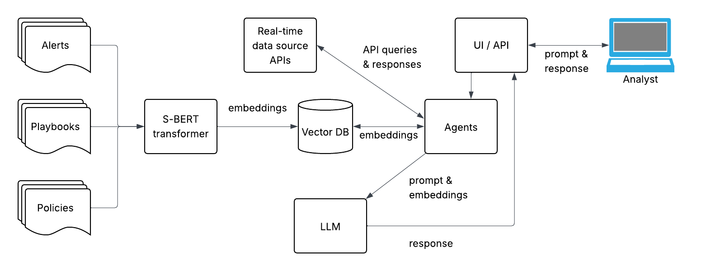
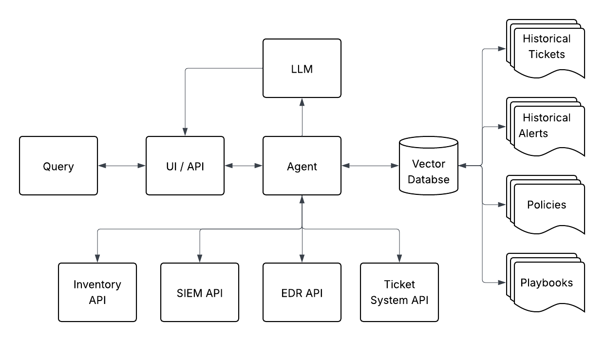

# Project Design and Architecture

## Training Datasets

In order to train the model with organization specific data, we will collect the following datasets:

* All security alerts and related comments received by the Operations Team over several years
* All internal and external policy documents
* Internal wiki and repository of security playbooks
* All incident and support ticket content from any ticket number referenced in an alert

## Additional Data

Additional data may be retrieved on demand as part of the alert handling process. This may include:

* Network and device inventory data
* SIEM logs
* EDR events
* Incident and support ticket notes

## Design Plan

* Collect and archive datasets described above for training our models
* Construct a development environment for testing our design and architecture
* Test several base-LLM options:
    * ChatGPT (if organizational tenant allows API access)
    * Internal LLM platform (if platform allows API access)
    * Self-hosted models (test across several models)
* Select base-LLM platform and build required infrastructure:
    * API client for ChatGPT or internal LLM platform
    * Hosting infrastructure and Ollama deployment for self-hosted
* Flatten training datasets into formats preferred by transformers
* Generate embeddings from subset of datasets using several sentence-transformers
* Store embeddings in an Milvus database
* Test embeddings against the selected LLM base model
* Select the best performing sentence-transformer and create embeddings for full datasets
* Create accurate prompts for querying the vector database
* Build an agent for querying the vector database and real-time data sources
* Build intermediate API for interacting with vector database and base-LLM
* Build front-end for security operations analysts
* Integrate with existing alert solution
* Test performance with a period of production measurement

# Architecture Diagram

## General Architecture

## Agent 

